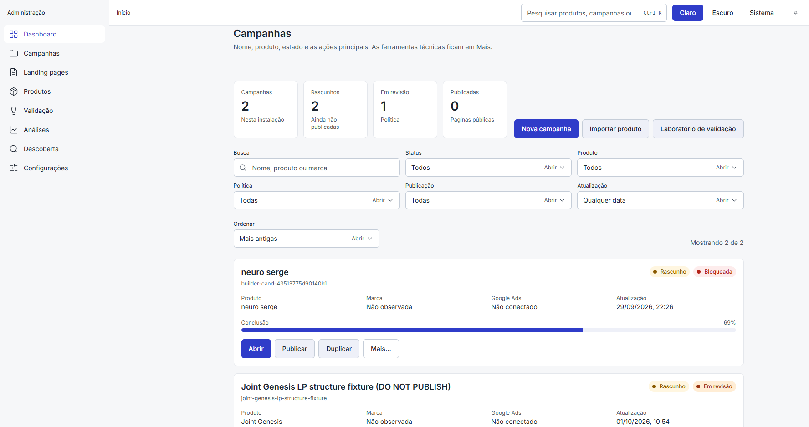
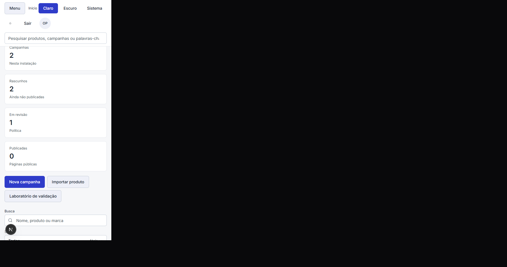

# Administration campaigns redesign — v3.1.1 execution 02

Date: 2026-10-07

The campaigns working area on `/admin#campanhas` now uses the same cards, buttons, spacing, and type as `/dashboard`. Routes, APIs, the database, and the publication rules are unchanged. Every previous campaign action remains reachable.

## Old UI

Each campaign was a card with the name, slug, publication badge, policy badge, and a text line `Completude 61%`. The same card then listed every tool as a text link:

Prévia or Ver página, Conceitos visuais, Análises, Verificação, Saúde do produto, Editor do produto, Landing page, Visual, Mídia, Layout, Histórico, Editar, Publicar or Retirar publicação, Duplicar, Excluir.

There was no search, status filter, or sort on the list.

## New UI

The section keeps the anchors `#campanhas`, `#landing-pages`, `#produtos`, and `#analises`.

Top bar:

- Campanhas, Rascunhos, Em revisão, Publicadas
- Nova campanha, Importar produto, Laboratório de validação

Those three actions appear once, in this toolbar. The overview above links to Campanhas and Análises.

Filters: Busca, Status, Produto, Política, Publicação, Atualização. Sort: Mais recentes, Mais antigas, Conclusão, Publicação, Política. The result line is `Mostrando N de M`.

Each card shows the name, slug, publication badge, policy badge, product, brand, Google Ads, last update, and a completion bar. Primary actions are Abrir, Publicar, Duplicar, and Mais. Mais holds the previous technical links, including Excluir and, for a published campaign, Retirar publicação.

Badges:

- Publicada, success
- Rascunho, warning
- Em revisão, review
- Bloqueada, danger
- Pronta, success

An empty installation shows “Nenhuma campanha encontrada” and Nova campanha. A filter with no matches shows the same title, the sentence “Nenhuma campanha corresponde a estes filtros.”, and Limpar filtros.

## Components reused

Card, Badge, Button, MetricCard, SearchInput, Select, EmptyState, SectionHeader, DuplicateButton, DeleteButton, UnpublishButton. The progress bar and the Mais menu are local to the campaign board because the design system has no progress or menu primitive.

## Files changed

- `src/app/admin/page.tsx`
- `src/app/admin/campaign-board.tsx`
- `src/app/admin/duplicate-button.tsx`
- `src/app/admin/delete-button.tsx`
- `src/app/admin/unpublish-button.tsx`

## Screenshots

Desktop, sorted oldest first:

Phone width, with the Menu button and stacked counts:

## Verification

- Search `neuro` left one card and the line `Mostrando 1 de 2`. Clearing restored both cards.
- Search `zzzz-sem-campanha` showed “Nenhuma campanha encontrada” and `Mostrando 0 de 2`.
- Mais recentes listed Joint Genesis before neuro serge. Mais antigas reversed that order.
- Mais opened on Prévia. ArrowDown moved focus to Conceitos visuais. The menu listed 13 items for a draft, including Verificação, Editor do produto, Landing page, Histórico, and Excluir. Those labels are not on the card face.
- At 390px the Menu button is present and two campaign headings remain in the section. `/dashboard` still shows Pesquisa de Mercado and Watchlist.

## Known limitations

- Google Ads on each card is the account status from the existing configuration read. A campaign row does not store its own ads status.
- Marca is the manufacturer stored on the campaign facts. When that field is empty the card says “Não observada”. An empty product name says “Não observado”.
- The shared Select trigger prints “Abrir” beside the current value. That is the existing control, separate from the campaign action Abrir.
- Publish, lint, and the builder pages keep their previous layout.
- Filters and sort run in the browser. `listCampaigns()` is still ordered by `updatedAt` descending.
- The empty-installation state was not opened against a database with zero campaigns.
